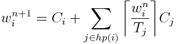

# Exercise 9 - Scheduling

## Properties

### Task 1:
 1. Why do we assign priorities to tasks?
 > Because some things are more important than others, and we must order the use of the resources in the system. For example must device drivers and real time constraints be prioritized. 
 
 
 2. What features must a scheduler have for it to be usable for real-time systems?
> A scheduler must be predictable, so we know about the worst-case behaviour when the algorithm is applied. It should also be simple and the scheduler must meet the given deadlines. 
 

## Inversion and inheritance

| Task | Priority   | Execution sequence | Release time |
|------|------------|--------------------|--------------|
| a    | 3          | `E Q V E`          | 4            |
| b    | 2          | `E V V E E E`      | 2            |
| c    | 1 (lowest) | `E Q Q Q E`        | 0            |

 - `E` : Executing
 - `Q` : Executing with resource Q locked
 - `V` : Executing with resource V locked

### Task 2: Draw Gantt charts to show how the former task set:
 1. Without priority inheritance
 
 
| Task |0|1|2|3|4|5|6|7|8|9|10|11|12|13|14|
|------|-|-|-|-|-|-|-|-|-|-|--|--|--|--|--|
| a    |-|-|-|-|E|-|-|-|-|-|-|Q|V|E|-|
| b    |-|-|E|V|-|V|E|E|E|-|-|-|-|-|-|
| c    |E|Q|-|-|-|-|-|-|-|Q|Q|-|-|-|E|
 
 2. With priority inheritance
 
 | Task |0|1|2|3|4|5|6|7|8|9|10|11|12|13|14|
|------|-|-|-|-|-|-|-|-|-|-|--|--|--|--|--|
| a    |-|-|-|-|E|-|-|Q|-|V|E|-|-|-|-|
| b    |-|-|E|V|-|-|-|-|V|-|-|E|E|E|-|
| c    |E|Q|-|-|-|Q|Q|-|-|-|-|-|-|-|E|

### Task 3: Explain:
 1. What is priority inversion? 
 > If a task is suspended waiting for a lower-priority task to complete some required computation (if it is blocked) then the priority model is beeing underminded and suffers from priority inversion. 
 >
 > It occours when a high priority task is forced to wait for the release of a shared resource that is currently beeing processed by a lower priority task. 
 
 2. What is unbounded priority inversion?
 > If the the high level priority is waiting forever (because the shared variable never releases from the low level priority).  
 
 3. Does priority inheritance avoid deadlocks?
 > No, when both tasks lock one resource each, it is too late to boost priorities of either one. So priority does not necessary avoid deadlocks. 

## Utilization and response time

### Task set 2:

| Task | Period (T) | Exec. Time (C) |
|------|------------|----------------|
| a    | 50         | 15             |
| b    | 30         | 10             |
| c    | 20         | 5              |

### Task 4:
 1. There are a number of assumptions/conditions that must be true for the utilization and response time tests to be usable (The "simple task model"). What are these assumptions? Comment on how realistic they are.
 > Fixed set of periodic, independent tasks with known periods - in a real time system it is realistic that the tasks are independent, and in many systems there are also known periods. The fixed set of tasks is not optimal, but can be worked around, so this statement could be realistic. 
 >
 > Constant worst-case execution times - Difficult to know a realistic worst-case estimate, so this is not realistic. But it is possible that this also could be worked around
 >
 > Deadlines equal to their periods - This will not give a very flexible system, but it is overall realistic. 
 > Rate-Monotonic Priority ordering - This is realistick (our choice)

 2. Perform the utilization test for the task set. Is the task set schedulable?
 > U = 5/20 + 10/30 + 15/50 = 0.883 <= 0.779 = 3*(2^(1/3)-1)
 > -> Utilization test fails, so we do not know if the task set is schedulable. 
 
 3. Perform response-time analysis for the task set. Is the task set schedulable? If you got different results than in 2), explain why.
 > Task c: 
 >
 > w0 = 5
 > 
 > Rc = 5 <= 20, ok
 >
 > Task b: 
 >
 > w0 = 10, w1 = 10 + ceil(10/20)*5 = 15, w2 = 10 + ceil(15/20)*5 = 15.
 >
 > Rb = 15 <= 30, ok
 
 > Task a: 
 > 
 > w0 = 15, w1 = 15 + ceil(15/30)*10 + ceil(15/20)*5 = 30, w2 = 35, w3 = 45, w4 = 50, w5 = 50.
 >
 > Ra = 50 <= 50, ok
 
 > So the task set is schedulable. We got a different result than in 2) because the response time analysis is both sufficient and necessary while the utilization test is sufficient, but not necessary. 
 
 4. (Optional) Draw a Gantt chart to show how the task set executes using rate monotonic priority assignment, and verify that your conclusions are correct.

## Formulas

Utilization:  

Response-time:  

