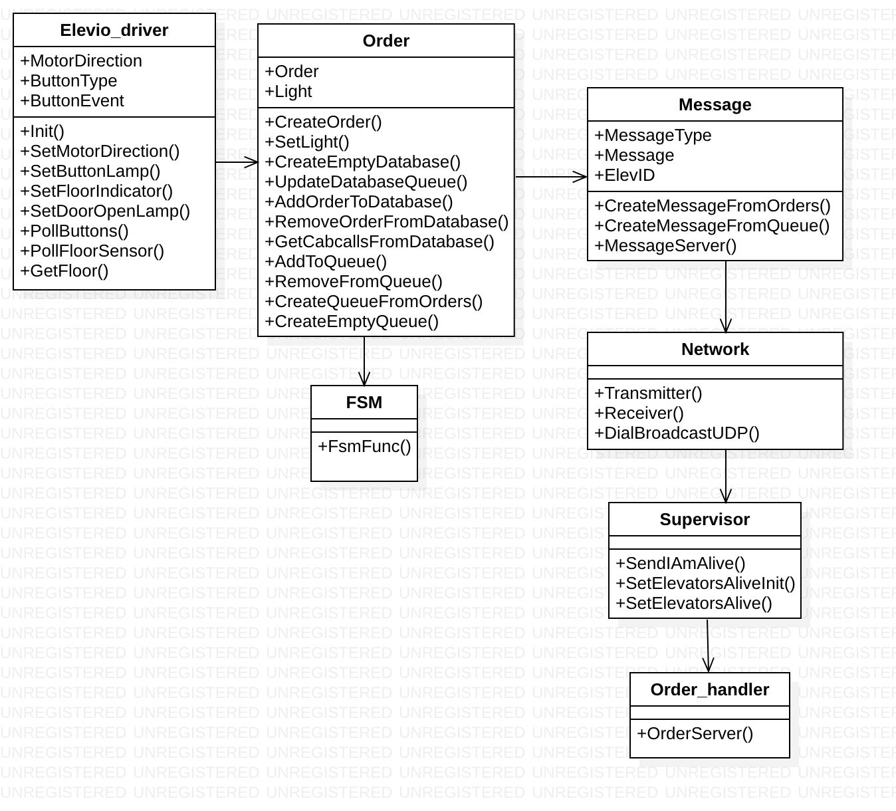
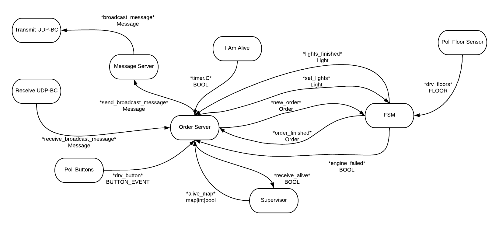

Elevator Project
================

Summary
-------
Software is created to control  `n` elevators working in parallel across `m`  floors.

The elevator project description is available [here](https://github.com/TTK4145/Project)

## Running the file

A bash script is created to run the elevator system. At each elevator run the bash script *heis.bash* with an unique id and a port. Setting the port equal zero will activate port 15657 which is the physical elevator. 

The system will automatically restart if you interrupt the program with ctrl+C.

## Documentation 
In addition to this README, a go doc API has been created. You will find the HTML files for the API documentation [here](https://github.com/TTK4145-students-2019/project-group-25/tree/master/doc/pkg/project-group-25) (doc->pkg->elevatorSystem).

Or you can view the API documentation on this [website](http://folk.ntnu.no/sondrehf/doc/pkg/elevatorSystem/ )

## Our system
Our system is written in [GOLANG](https://golang.org), and it's based on a peer to peer design. UDP broadcasting is used for transmitting and receiving a defined message struct. The heart of our system is the defined "I'm alive" signal that every elevator sends every 250ms and is received by the other elevators. Every elevator counts the number of "I'm alive" signal that it has received from the other elevators and creates a local list of who is alive. The local list of who is alive resets every seconds and it require at least one "I'm alive" to update. This means that in worst case, one second can pass before the elevator that has died is presumed dead by the others. 

Every elevator knows about every other elevator's orders and posistion. If one elevator dies and has unattended hall calls, these will be distributed to the elevator with the lowest id that is still living. If the elevator that dies has unattended cab calls, it will fetch these from another living elevator when it is online again. 

When an elevator is offline it will work as a single elevator until it is online again. 

If the elevator discovers that the engine is broken (if it does not reach a new floor in 10 seconds when it's in the moving state) it will put itself offline and print a message that the engine is broken. When the motor is working again, it will continue taking the order that it was executing (before engine failure). When it has executed the order, it will automatically put itself online again and the elevator system will work normally again. 

## Modules 

Our system is divided into seven modules

### Modules created by us
1. OrderHandler
    1. This is our most important module. In this package all orders gets distributed or received. It handles every order and acts as a control center for every local elevator. Every message that is received over UDP has a message type specified, so it is here the message is decrypted. 
2.  Order
    1. This module takes care of each order. Creates orders and adding or removing them to the elevators database, which is the place where each 
3.  FSM
    1. The state machine. This controls every elevator's state and the state changing of these. The states are divided into init, idle, moving and door open. It is here the orders received are actually taken care of. It triggers on when it receives a new order. When this is received it calculates the direction given its current floor and drives to the given floor. When arriving, it will open the doors three seconds before closing again. 
    2. This is also where we check for engine error. If it doesn't read a floor in 10 seconds when it is in the moving state, we know that something is wrong. It will then send a engine failed flag. When it is back up running, it will remove the flag. 
    3. When the order is successfully executed it will send order finished to the order server.  
4.  Supervisor
    1. This takes care of the "I am alive" signals. The functions for sending and setting elevators alive is created here. This is where we keep an updated map of which elevators that is alive. 
5.  Message
    1. This is where we create the messages that are sent using UDP. This is also where the message server is. The message server handles the requirement of acknowledgment signals. Every message that is sent (except "I am alive" messages) resends ten times (every 50ms) or until it receives an identical message back (with ACK as message type)
### Modules already given 
6.  Elevator driver
    1. Module for setting the actuators of the system. Setting light, polling buttons and floor sensors.
7.  Network
    1. Module used for UDP communication. Broadcasting on a port and receiving on the same port. 

### The modules diagram

    
## Channels 

How the channels are used and how they are connected is shown in the diagram below. 

## Addtitional Comments: 
1. The database used for storing every elevator's queue is created as a 3D-array. In hindsight it should probably have been created using maps (as we did in other parts of the system). This would have given and easier to read and easier to operate database-system.
2. The engine error flags after 10 seconds (if it doesn't reach a floor in 10 seconds). This is not scalable given a larger elevator system. However in our case this was more than sufficient. We could also increase the timer, but we didn't find it necessary. 
